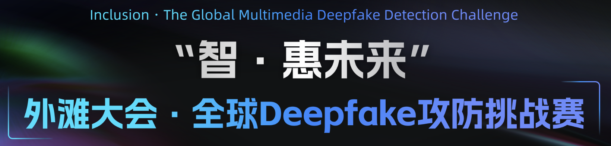

<h2 align="center"> <a href="">DeepFake Defenders</a></h2>
<h5 align="center" style="word-break: keep-all;" > 저희의 프로젝트가 마음에 드신다면, GitHub에서 별 ⭐ 을 GitHub에서 눌러 최신 업데이트를 받아보세요.</h5>


<h5 align="center">

<!-- PROJECT SHIELDS -->
[](https://github.com/VisionRush/DeepFakeDefenders/blob/main/LICENSE)

[](https://hits.seeyoufarm.com)

[](https://github.com/PKU-YuanGroup/MoE-LLaVA/issues?q=is%3Aopen+is%3Aissue)
[](https://github.com/PKU-YuanGroup/MoE-LLaVA/issues?q=is%3Aissue+is%3Aclosed)  <br>

</h5>

<p align='center'>
  
</p>

💡 [[영어 문서 / ENGLISH DOC](README)]와 [[중국어 문서 / CHINESE DOC](README_zh.md)]를 제공하고 있습니다. 저희는 이 프로젝트에 대한 기여를 매우 환영하고 감사드립니다.

## 📣 뉴스

* **[2024.09.05]**  🔥 Deepfake defenders의 초기 버전을 공식적으로 릴리즈했으며, [[Bund에서의 컨퍼런스](https://www.atecup.cn/deepfake)]에서 deepfake challenge에서 3등을 수상했습니다.

## 🚀 빠르게 시작하기

### 1. 사전에 훈련된 모델 준비하기

시작하기 전, ImageNet-1K로 사전에 훈련된 가중치 파일들을 `./pre_model` 디렉토리에 넣어주세요. 가중치 파일들의 다운로드 링크들은 아래와 같습니다.
```
RepLKNet: https://drive.google.com/file/d/1vo-P3XB6mRLUeDzmgv90dOu73uCeLfZN/view?usp=sharing
ConvNeXt: https://dl.fbaipublicfiles.com/convnext/convnext_base_1k_384.pth
```

### 2. 처음부터 훈련시키기

#### 2.1 데이터셋의 경로 조정하기

학습에 필요한 파일인 트레이닝셋 파일인 **(\*.txt)** 파일, 벨리데이션셋 파일 **(\*.txt)**, 라벨 파일 **(\*.txt)** 을 dataset 폴더에 넣고, 파일들을 같은 이름으로 지정하세요. (dataset 아래에 다양한 txt 예제들이 있습니다)

#### 2.2 하이퍼 파라미터 조정하기

두 모델(RepLKNet과 ConvNeXt)을 위해 `main_train.py`의 파라미터가 아래와 같이 설정되어야 합니다.

```python
# RepLKNet으로 설정
cfg.network.name = 'replknet'; cfg.train.batch_size = 16
# ConvNeXt으로 설정
cfg.network.name = 'convnext'; cfg.train.batch_size = 24
```

#### 2.3 훈련 스크립트 사용하기

##### 다중 GPU: ( GPU 8개가 사용되었습니다. )
```shell
bash main.sh
```

##### 단일 GPU:
```shell
CUDA_VISIBLE_DEVICES=0 python main_train_single_gpu.py
```

#### 2.4 모델 조립하기

`mergy.py`의 ConvNeXt로 훈련된 모델 경로와 RepLKNet으로 훈련된 경로를 바꾸고, `python mergy.py`를 실행시켜 최종 인퍼런스 테스트 모델을 만듭니다.

#### 2.5 인퍼런스

다음의 예제는 **POST** 요청 인터페이스를 사용하여 이미지 경로를 매개변수로 요청하여 모델이 예측한 딥페이크 점수를 응답을 출력합니다.

```python
#!/usr/bin/env python
# -*- coding:utf-8 -*-
import requests
import json
import requests
import json

header = {
    'User-Agent': 'Mozilla/5.0 (Windows NT 10.0; Win64; x64) AppleWebKit/537.36 (KHTML, like Gecko) Chrome/92.0.4515.107 Safari/537.36'
}

url = 'http://ip:10005/inter_api'
image_path = './dataset/val_dataset/51aa9b8d0da890cd1d0c5029e3d89e3c.jpg'
data_map = {'img_path':image_path}
response = requests.post(url, data=json.dumps(data_map), headers=header)
content = response.content
print(json.loads(content))
```

### 3. Docker에 배포하기

#### 빌드하기

```shell
sudo docker build  -t vision-rush-image:1.0.1 --network host .
```

#### 실행시기키

```shell
sudo docker run -d --name  vision_rush_image  --gpus=all  --net host  vision-rush-image:1.0.1
```

## Star History

[](https://star-history.com/#DeepFakeDefenders/DeepFakeDefenders&Date)
